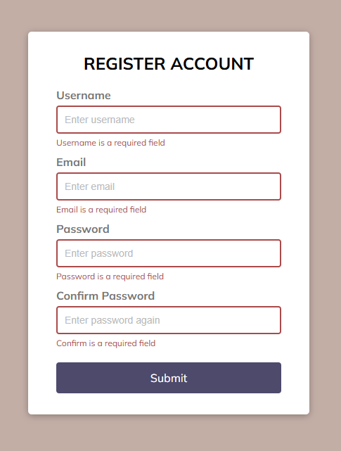
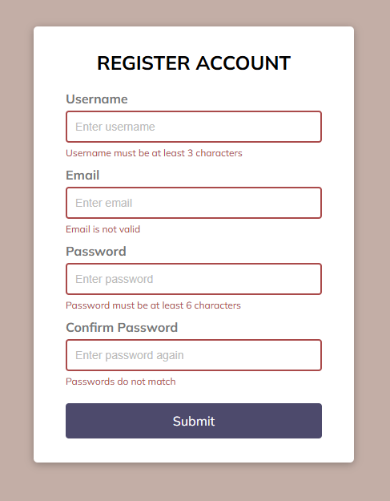
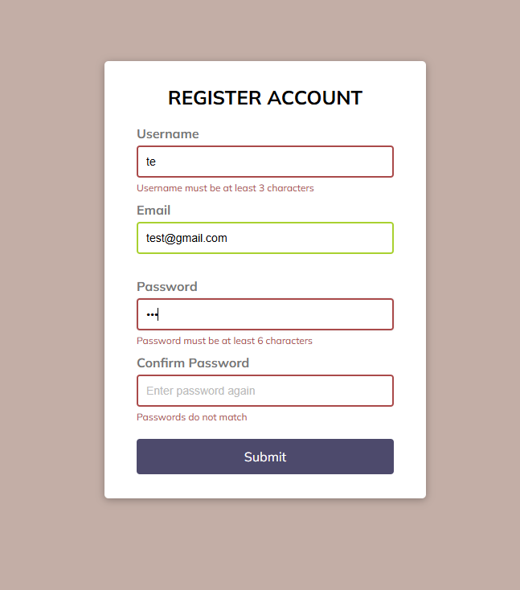
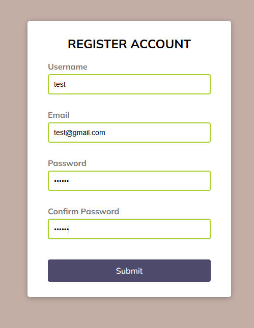

## Form Validation with TypeScript
>Real-time form validation with TypeScript

Submitting the form **without** filling out input fields:



Validation error messages:



Validation errors with valid input data:



All valid data, passing logic check:



## App Usage

Install dependencies:
```
npm install
```

Run app on `lite-server`:
```
npm start
```

Set TypeScript compiler to watch mode:
```
tsc -w
```
